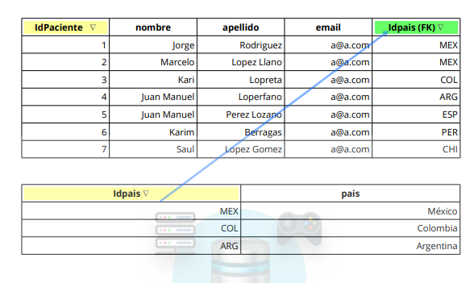

# Base-de-Datos-I

## 1 - [Unidad I](#UnidadI)
#### 1.1 - [¿Que es SQL?](#Queessql)
#### 1.2 - [¿Qué es T-SQL?](#QuéesT-SQL)
#### 1.3 - [Microsoft SQL Server](#MicrosoftSQLServer)
#### 1.4 - [UNIDADES DE MEDIDA EN INFORMATICA](#UNIDADESDEMEDIDAENINFORMATICA)
#### 1.5 - [TIPOS DE DATO SQL SERVER](#TIPOSDEDATOSQLSERVER)
#### 1.6 - [Integridad de la Base de Datos](#IntegridaddelaBasedeDatos)
#### 1.7 - [**Ejercicio** Crear las Tablas de nuestra Base de datos.](#EjercicioCrearlasTablasdenuestraBasededatos)

# Unidad I 
## Fudamentos de Estructuras de Datos
#
### **¿Que es SQL?** 
#### SQL Structured Query Language en español Lenguaje de consulta Estructurado, es un lenguaje específico utilizado en programación, diseñado para administrar, y recuperar información de sistemas de gestión de bases de datos relacionales.
#### Una de sus principales características es el manejo de álgebra y el cálculo relacional para realizar consultas y obtener información de forma sencilla, y además para realizar cambios en ella.

### **¿Qué es T-SQL?**
#### T-SQL (Transact-SQL) es la manera en que se comunican las instrucciones de manipulación de datos que gestiona el usuario con el Servidor; las cuales permiten realizar operaciones claves en SQL Server, como creación y modificación de esquemas de base de datos, inserción y modificación de datos y además la administración del propio Servidor de Base de Datos.

#### Esto se realiza mediante el envío de sentencias e instrucciones en T-SQL que son procesadas por el servidor y los resultados regresan a la aplicación cliente.

#### Transact-SQL incluye características propias de cualquier lenguaje de programación que nos permiten definir:
    Tipos de datos.
    Definición de variables.
    Estructuras de control de flujo.
    Gestión de excepciones.
    Funciones predefinidas.

### Sin embargo no nos permite:
    Crear interfaces de usuario.
    Crear aplicaciones ejecutables.

## **Microsoft SQL Server**
####  Es un sistema de manejo de bases de datos del modelo relacional, desarrollado por la empresa Microsoft.

#### El lenguaje utilizado (que puede ser ejecutado por línea de comandos o mediante la interfaz gráfica de Management Studio) es Transact-SQL T-SQ

## **UNIDADES DE MEDIDA EN INFORMATICA** 

#### La información, al igual que ocurre con el peso o con el volumen, se puede medir. Dependiendo de si tenemos más o menos cantidad de información usaremos unas u otras de las siguientes unidades de medida:

#### **bit (b):** Es la unidad más pequeña de información. La palabra bit proviene de Binary digIT , es decir dígito binario en castellano.Los únicos valores de información que puede contener son 0 y 1.Como vimos en la sección anterior un bit de información almacenado por ejemplo en la memoria RAM equivaldría a un transistor con voltaje bajo si tiene almacenado un 0 o con voltaje normal si tiene almacenado un 1:

#### **Byte (B):**Equivale a 8 bits, y es la cantidad necesaria de bits para almacenar un carácter. Por ejemplo un archivo de texto con 10 caracteres, ocuparía en memoria 10 bytes o lo que es lo mismo 80 bits.
    1 B = 8 bits

#### **Kilobyte (KB):**Un Kilobyte es igual a 1024 Bytes. Esta unidad de medida se usa para expresar la cantidades pequeñas de información.
    1 KB=1024 Bytes= 210 Bytes

#### **Megabyte(MB):**Un Megabytes es igual a 1024 Kilobytes. Se usa para cantidades medianamente grandes de información, por ejemplo para expresar lo que ocupa un archivo de música.
    1 MB= 1024 KB=  220 Bytes

#### **Gigabyte (GB):** Un Gigabye son 1024 Megabytes. Esta unidad se usa para cantidades grandes de información como por ejemplo para expresar la capacidad de un disco duro.
    1 GB= 1024 MB= 230 Bytes

#### **Terabyte (TB):** El Terabyte equivale a 1024 GB. Se utiliza para cantidades enormes de información como para medir la capacidad de almacenamiento de una supercomputadora o de algunos discos duros actuales.
    1 TB= 1024 GB= 240 Bytes

#### En el siguiente esquema vemos un resumen en forma de escalera de cómo hacer las conversiones entre las diferentes unidades de medida de la información, para pasar de una unidad más grande a otra más pequeña,es decir bajar escalones, multiplicaremos y para pasar de una más pequeña a otra mayor, es decir subir escalones, dividiremos:

## TIPOS DE DATO SQL SERVER 

### TIPOS DE DATOS STANDARD (Más utilizados)
#### Numéricos
##### Enteros BIT, TINYINT, SMALLINT, INT, BIGINT
##### Decimales MONEY, DECIMAL
#### Texto y Binarios
##### CHAR, VARCHAR, NCHAR, NVARCHAR
##### BINARY, VARBINARY
#### Fecha y Hora
##### DATE, TIME, DATETIME, SMALLDATETIME

### Descripción de Tipos de Dato y sus tamaños posibles
#### BIT 1 byte
    0 ó 1
    True o False
#### TINYINT 1 byte
    0 a 255
#### SMALLINT 2 bytes
    -2^15 (-32,768) HASTA 2^15-1 (32,767)
#### INT 4 bytes
    -2^31 (-2,147,483,648) HASTA 2^31-1 (2,147,483,647)
#### BIGINT 8 bytes
    -2^63 (-9,223,372,036,854,775,808) HASTA 2^63-1 (9,223,372,036,854,775,807)
#### MONEY 8 bytes
    -922,337,203,685,477.5808 HASTA 922,337,203,685,477.5807

# 
## Integridad de la Base de Datos 
### PRIMARY KEY
#### Definiciones y reglas generales
##### 1. La clave primaria o primary key, identifica de manera unívoca (única) a cada registro de una tabla.
##### 2. El valor que contiene la columna definida como primary key, debe ser único.
##### 3. El valor debe ser NOT NULL (no permitirá valores nulos)
##### 4. Una tabla puede tener más de un campo PK, a la que llamaremos CLAVE COMPUESTA
##### 5. Sea SIMPLE o COMPUESTA, cada tabla solo podrá tener una clave primaria (PRIMARY KEY)

|IdPaciente|Nombre|Apellido|Email|idPais|
|----------|------|--------|-----|------|
|i|Jorge|Rodriguez|a@a.com|MEX|
|2|Marcelo|Lope Llano|a@a.com|MEX|
|3|Kari|Lopreta|a@a.com|COL|
|4|Juan Manuel|Loerfano|a@a.com|ARG|
|5|Juan Manuel|Perez Lozano|a@a.com|ESP|
|6|Karim|Berragas|a@a.com|PER|
|7|Saul|Lpez Gomez|a@a.com|CHI|

### Definiciones y reglas generales
##### 1. La clave foránea o foreign key, debe ser del mismo tipo de dato que su campo relacionado.
##### 2. El valor del campo definido como FK puede ser NULL
##### 3. Una tabla puede tener más de un campo FK

## Restricciones y propiedades de campos

### Usar Transact-SQL
##### Creación de una clave principal en una tabla existente En el ejemplo siguiente se crea una clave principal en la columna TransactionID de la base de datos de AdventureWorks.

Codigo:
~~~sql
ALTER TABLE Production.TransactionHistoryArchive
   ADD CONSTRAINT PK_TransactionHistoryArchive_TransactionID PRIMARY KEY CLUSTERED (TransactionID);
~~~

### Creación de una clave principal en una tabla nueva
##### En el ejemplo siguiente se crea una tabla y se define una clave principal en la columna TransactionID de la base de datos de AdventureWorks.
~~~sql
CREATE TABLE Production.TransactionHistoryArchive1
   (
      TransactionID int IDENTITY (1,1) NOT NULL
      , CONSTRAINT PK_TransactionHistoryArchive1_TransactionID PRIMARY KEY CLUSTERED (TransactionID)
   );
~~~

## Creando Nuestra Primera Base de datos.
#### Se adjunta un video tutorial que le muestra cómo crear una base de datos en Sql Server.

#### Haz el ejercicio paso a paso.

#### **Recuerda que el secreto del éxito está en la perseverancia.**
[Creacion de nuestra primera Base de datos](https://www.youtube.com/watch?v=SZprT1ebLcU)

#

## **Ejercicio** Crear las Tablas de nuestra Base de datos. 

### Tabla de pacientes.

~~~sql
CREATE TABLE [dbo].[Paciente](
	[idPaciente] [int] Primary key Identity,
	[nombre] [varchar](50) NULL,
	[apellido] [varchar](50) NULL,
	[fNacimiento] [date] NULL,
	[domicilio] [varchar](50) NULL,
	[idPais] [char](3) NULL,
	[telefono] [varchar](20) NULL,
	[email] [varchar](30) NULL,
	[observacion] [varchar](1000) NULL,
	[fechaAlta] [datetime] NULL
)
GO
~~~

### Dado este ejemplo
#### Se procederá a la creación de las siguientes tablas de nuestra base de datos.

## [Historia]

        [idHistoria] [int] 
        [fechaHistoria] [datetime]
        [observacion] [varchar](2000)
        [fechaAlta] [datetime] 

## [HistoriaPaciente]
        [idHistoria] [int]
        [idPaciente] [int]
        [idMedico] [int] 

## [TurnoPaciente]
        [idTurno] [int] 
        [idPaciente] [int] 
        [idMedico] [smallint]
    CONSTRAINT [PK_PacienteTurno] PRIMARY KEY CLUSTERED

## [Turno]
        [idTurno] [int]
        [fechaTurno] [datetime]
        [fechaAlta] [datetime]
        [estado] [nchar](10)
    CONSTRAINT [PK_Turno] PRIMARY KEY CLUSTERED 

## [Pais]
        [idPais] [char](3)
        [pais] [varchar](30)
    CONSTRAINT [PK_Pais] PRIMARY KEY CLUSTERED 

## [Especialidad]
        [idEspecialidad] [int] IDENTITY(1,1)
        [especialidad] [varchar](30) 
    CONSTRAINT [PK_Especialidad] PRIMARY KEY CLUSTERED 

## [Medico]
        [idMedico] [dbo].[medico] IDENTITY(1,1)
        [nombre] [varchar](50)
        [apellido] [varchar](50)
    CONSTRAINT [PK_Medico] PRIMARY KEY CLUSTERED 

## [MedicoEspecialidad]
        [idMedico] [int] 
        [idEspecialidad] [int]
        [descripcion] [varchar](50)
    CONSTRAINT [PK_MedicoEspecialidad] PRIMARY KEY CLUSTERED 

#### Cree las tablas que se muestran en el ejercicio.
#### Preste mucha atención al tipo de datos y su tamaño.

#### Debe enviar estos códigos en formato TXT o SQL. Te lo explicaremos en el aula.
#### **Recuerda que el secreto del éxito está en la perseverancia.**
#

## Comandos SQL para manipulación de registros

## Comandos SQL para manipulación de registros

## Cláusulas SQL

# UNIDAD II

## Tipos de datos Sql

##  Diseñando nuestra primer Base de Datos

## Funciones de Agregado

## Operadores Lógicos

## Stored Procedures

## Estructuras de Control

## Operadores Aritméticos y de Comparación

# UNIDAD III

## Programando Store Procedures

## Funciones de Conversion y Texto

# UNIDAD IV

## Join y Unions en SQL

## Programando Stored Procedures de SELECT UPDATE y DELETE

# 

